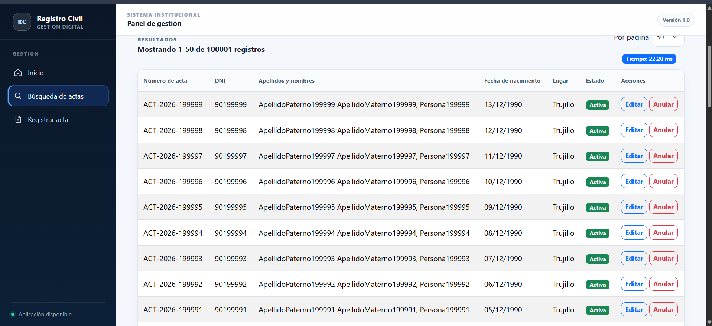
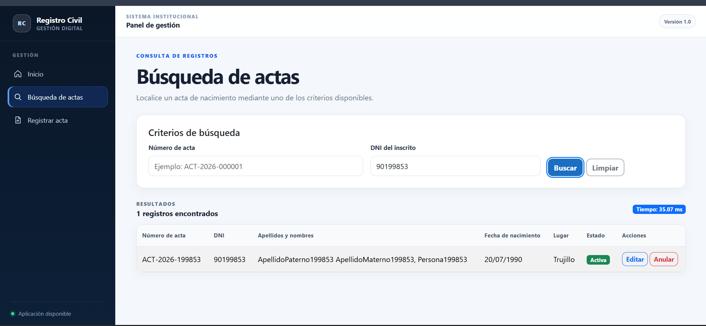
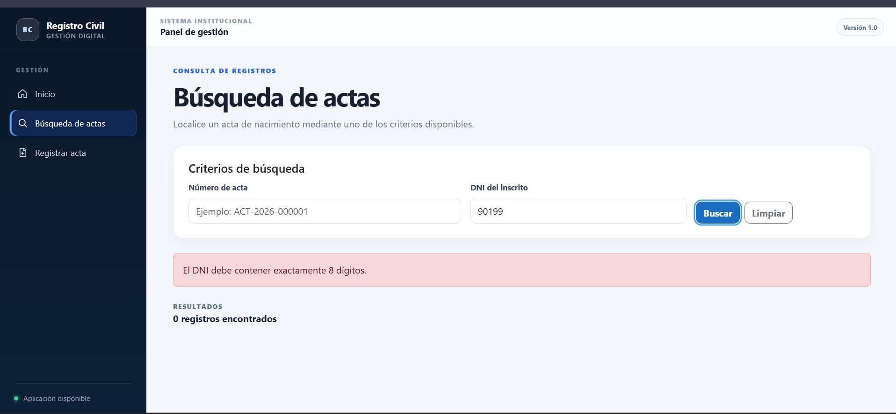
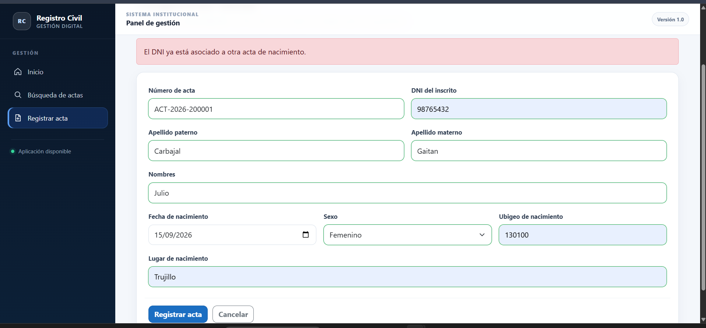
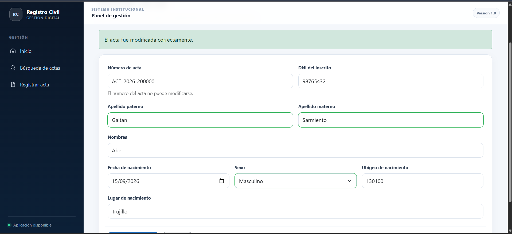
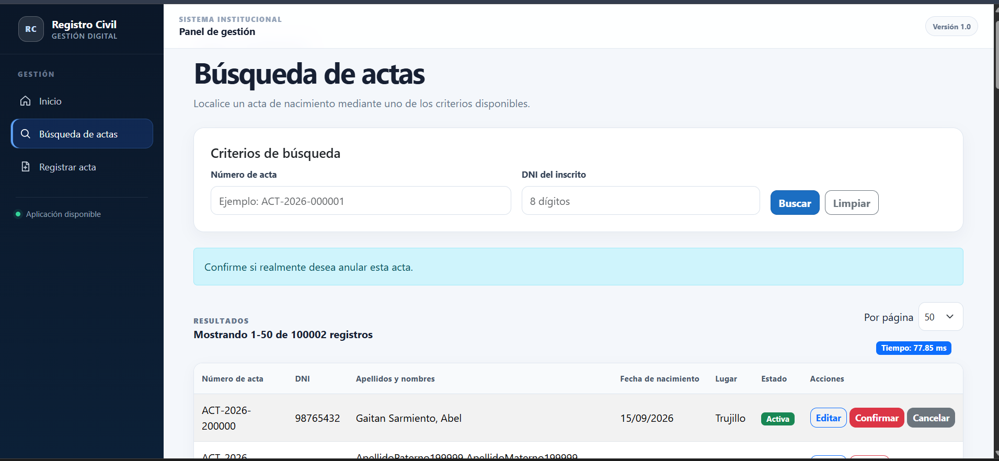
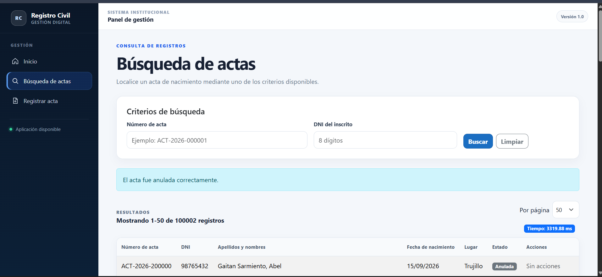
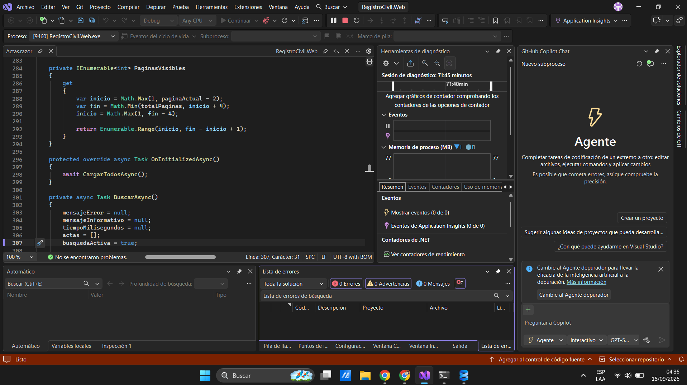
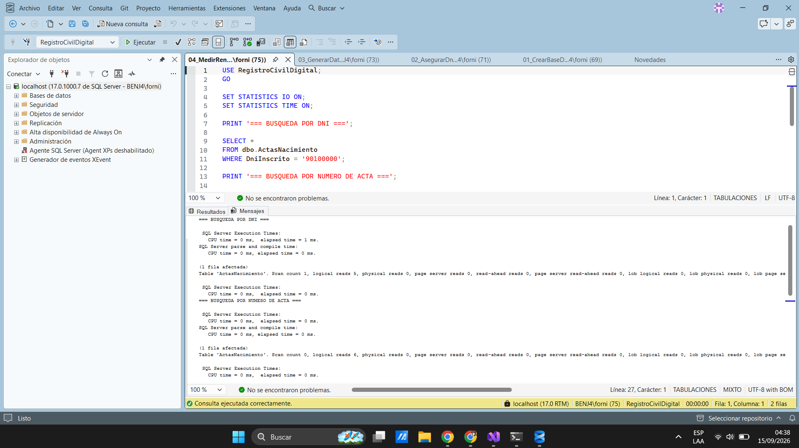

# Plan de Pruebas de Software - Registro Civil Digital

## 1. Alcance y Objetivos
Este documento tiene los casos de prueba ejecutados para validar la integridad, rendimiento y usabilidad del sistema **Registro Civil Digital** (.NET 10 / SQL Server 2022).

## 2. Casos de Prueba Ejecutados

### Búsqueda y Consulta de Actas por DNI
* **Objetivo:** Verificar la respuesta rápida del sistema al realizar búsquedas indexadas.
* **Resultado Esperado:** Visualización de actas vinculadas al DNI en menos de 100 ms.
* **Resultado Obtenido:** Exitoso.

### Validaciones de Negocio y Formato
* **Objetivo:** Validar que el sistema impida el registro de DNI inválidos o actas duplicadas.
* **Resultado Esperado:** Despliegue de mensajes de error predefinidos en la interfaz web.
* **Resultado Obtenido:** Exitoso.

### Optimización de Consultas SQL
* **Objetivo:** Evaluar el rendimiento de las consultas sobre la base de datos local SQL Server 22.
* **Resultado Esperado:** Reducción del tiempo de respuesta mediante el uso de índices.
* **Resultado Obtenido:** Exitoso.

## 3. Matriz de Evidencias

| ID Evidencia | Descripción | Archivo Relacionado |
| :--- | :--- | :--- |
| EV-01 | Búsqueda y Listado de Actas | `Evidencia/01_busqueda_listar.png` |
| EV-02 | Consulta Filtrada por DNI | `Evidencia/02_busqueda_dni.png` |
| EV-03 | Validación de Formato DNI | `Evidencia/03_validacion_dni.png` |
| EV-04 | Registro Correcto de Acta | `Evidencia/04_registro_correcto.png` |
| EV-05 | Validación de DNI Duplicado | `Evidencia/05_dni_duplicado.png` |
| EV-06 | Edición de Registro | `Evidencia/06_edicion.png` |
| EV-07 | Anulación - Paso 1 | `Evidencia/07_anulacion1.png` |
| EV-08 | Anulación - Paso 2 | `Evidencia/07_anulacion2.png` |
| EV-09 | Compilación en Terminal | `Evidencia/08_compilacion.png` |
| EV-10 | Rendimiento y Búsqueda SQL | `Evidencia/09_rendimiento.png` |

---

## 4. Galería de Evidencias de Prueba

### Búsqueda y Consulta de Actas

### Validaciones de Negocio y Errores

### Gestión de Actas

### Compilación y Rendimiento SQL Server 2022

---